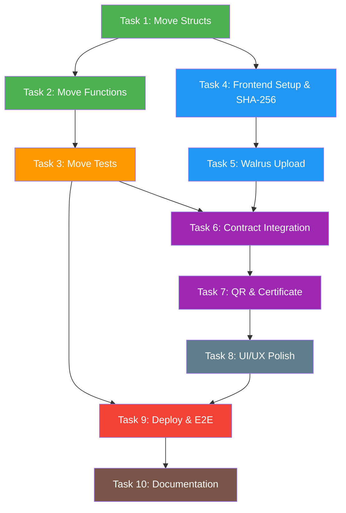

# 📋 Hệ thống Chứng thực & Xác thực số (Proof of Existence)

> **Project Codename**: `proof-of-existence`
> **Created**: 2026-08-31
> **Status**: 🟡 Planning

---

## 1. Overview & Tech Stack

### 1.1 Mục tiêu dự án

Xây dựng hệ thống cho phép người dùng **chứng minh một tài liệu, ảnh hoặc sản phẩm thủ công là "chính chủ"** và đã tồn tại vào một thời điểm nhất định. Hệ thống chống giả mạo, chống sửa đổi lịch sử thông qua việc lưu trữ bằng chứng bất biến trên blockchain Sui.

### 1.2 Tech Stack

| Layer              | Công nghệ                                      |
| ------------------ | ----------------------------------------------- |
| Smart Contract     | **Sui Move** (Move 2024 Edition)                |
| Decentralized Storage | **Walrus** (fallback: IPFS)                  |
| Frontend           | **React / Next.js** + `@mysten/dapp-kit` + `@mysten/sui` |
| Cryptography       | **SHA-256** (client-side hashing)               |
| QR Code            | `qrcode.react` hoặc `qrcode`                   |

### 1.3 Luồng hoạt động chính

```
┌──────────────┐    SHA-256     ┌──────────────┐   Upload    ┌──────────────┐
│   User       │ ──────────▶   │   Frontend   │ ─────────▶  │   Walrus     │
│   Upload     │   Hash file   │   (Next.js)  │  file gốc   │   Storage    │
└──────────────┘               └──────┬───────┘             └──────┬───────┘
                                      │                            │
                                      │  hash + blob_id +         │ Blob ID
                                      │  metadata                 │
                                      ▼                            │
                               ┌──────────────┐◀───────────────────┘
                               │  Sui Move    │
                               │  Contract    │
                               │  (On-chain)  │
                               └──────┬───────┘
                                      │
                                      │  ProofObject (NFT)
                                      ▼
                               ┌──────────────┐
                               │  Chứng nhận  │
                               │  số + QR     │
                               └──────────────┘
```

---

## 2. Architecture & Data Model

### 2.1 Sui Move — Struct Definitions

```move
/// Bằng chứng tồn tại — được lưu trữ như một Object trên Sui
public struct ProofObject has key, store {
    id: UID,
    /// SHA-256 hash của file gốc (hex string, 64 chars)
    content_hash: String,
    /// Walrus Blob ID hoặc IPFS CID
    blob_id: String,
    /// Địa chỉ ví của người tạo bằng chứng
    owner: address,
    /// Metadata mở rộng
    metadata: ProofMetadata,
    /// Timestamp (epoch ms) tại thời điểm tạo proof
    created_at: u64,
}

/// Metadata đính kèm bằng chứng
public struct ProofMetadata has store, drop, copy {
    /// Tên sản phẩm / tài liệu
    name: String,
    /// Mô tả ngắn
    description: String,
    /// Vị trí GPS (optional, dạng string "lat,lng")
    location: String,
    /// Danh mục (document | image | product | other)
    category: String,
}
```

### 2.2 Sui Move — Events

```move
/// Event phát ra khi một proof mới được tạo
public struct ProofCreated has copy, drop {
    proof_id: ID,
    content_hash: String,
    owner: address,
    created_at: u64,
}

/// Event phát ra khi proof bị thu hồi
public struct ProofRevoked has copy, drop {
    proof_id: ID,
    owner: address,
}
```

### 2.3 Sui Move — Registry (Global)

```move
/// Registry toàn cục để tra cứu hash đã tồn tại hay chưa (chống trùng)
public struct ProofRegistry has key {
    id: UID,
    /// Table ánh xạ content_hash -> proof_id
    proofs: Table<String, ID>,
    /// Tổng số proof đã tạo
    total_proofs: u64,
}
```

### 2.4 Frontend Data Flow

```
Upload File
    │
    ├──▶ Web Crypto API: SHA-256(file) → hash (hex)
    │
    ├──▶ Walrus SDK: upload(file) → blob_id
    │
    ├──▶ Sui Transaction:
    │       move_call("proof_of_existence::core::create_proof", {
    │           registry,
    │           content_hash: hash,
    │           blob_id: blob_id,
    │           name, description, location, category
    │       })
    │       → ProofObject ID
    │
    └──▶ QR Generator: encode(proof_id + content_hash) → QR Code
```

---

## 3. Cấu trúc thư mục dự kiến

```
proof-of-existence/
├── PLAN.md
├── contracts/
│   └── proof_of_existence/
│       ├── Move.toml
│       └── sources/
│           ├── core.move            # Logic chính: create, verify, revoke
│           └── registry.move        # ProofRegistry & tra cứu
│       └── tests/
│           └── core_tests.move      # Unit tests
├── frontend/
│   ├── package.json
│   ├── next.config.js
│   ├── tsconfig.json
│   ├── src/
│   │   ├── app/
│   │   │   ├── layout.tsx
│   │   │   ├── page.tsx             # Landing page
│   │   │   ├── create/
│   │   │   │   └── page.tsx         # Trang tạo proof
│   │   │   └── verify/
│   │   │       └── page.tsx         # Trang xác minh proof
│   │   ├── components/
│   │   │   ├── FileUploader.tsx     # Upload + SHA-256 hash
│   │   │   ├── ProofCard.tsx        # Hiển thị proof
│   │   │   ├── QRGenerator.tsx      # Sinh mã QR
│   │   │   ├── VerifyForm.tsx       # Form xác minh
│   │   │   └── WalletConnect.tsx    # Kết nối ví Sui
│   │   ├── hooks/
│   │   │   ├── useCreateProof.ts    # Hook gọi contract
│   │   │   ├── useVerifyProof.ts    # Hook xác minh
│   │   │   └── useWalrusUpload.ts   # Hook upload Walrus
│   │   ├── lib/
│   │   │   ├── hash.ts              # SHA-256 utility
│   │   │   ├── walrus.ts            # Walrus client
│   │   │   ├── sui.ts               # Sui client config
│   │   │   └── constants.ts         # Package ID, network config
│   │   └── types/
│   │       └── proof.ts             # TypeScript types
│   └── public/
│       └── ...
└── README.md
```

---

## 4. Task Breakdown

---

### Phase 1: Smart Contract Foundation

---

#### Task 1: Move Package & Struct Definitions

| Field     | Detail |
| --------- | ------ |
| **Objective** | Khởi tạo Move package và định nghĩa tất cả struct, event cần thiết. |
| **Files**     | `contracts/proof_of_existence/Move.toml`, `contracts/proof_of_existence/sources/core.move`, `contracts/proof_of_existence/sources/registry.move` |

**Details**:

1. Khởi tạo Move package với `Move.toml`:
   - Package name: `proof_of_existence`
   - Edition: `2024.beta` (Move 2024 Edition)
   - Dependencies: `Sui` framework
2. Trong `core.move`:
   - Định nghĩa `ProofMetadata` struct (has `store, drop, copy`)
   - Định nghĩa `ProofObject` struct (has `key, store`) với các field: `id`, `content_hash`, `blob_id`, `owner`, `metadata`, `created_at`
   - Định nghĩa event `ProofCreated` và `ProofRevoked`
3. Trong `registry.move`:
   - Định nghĩa `ProofRegistry` struct (has `key`) với `Table<String, ID>` và `total_proofs`
   - Viết hàm `init` (one-time setup) để tạo và share `ProofRegistry`

**Definition of Done (DoD)**:
- [x] `sui move build` thành công, không error
- [x] Tất cả struct có đúng abilities (`key`, `store`, `copy`, `drop`)
- [x] `ProofRegistry` được tạo trong `init` và shared via `transfer::share_object`
- [x] Code tuân thủ Move 2024 Edition syntax

---

#### Task 2: Move Core Functions & Events

| Field     | Detail |
| --------- | ------ |
| **Objective** | Implement các hàm chính: `create_proof`, `verify_proof`, `revoke_proof`. |
| **Files**     | `contracts/proof_of_existence/sources/core.move`, `contracts/proof_of_existence/sources/registry.move` |

**Details**:

1. **`create_proof`**:
   - Input: `registry: &mut ProofRegistry`, `content_hash: String`, `blob_id: String`, `name: String`, `description: String`, `location: String`, `category: String`, `clock: &Clock`, `ctx: &mut TxContext`
   - Logic:
     - Assert `content_hash` chưa tồn tại trong registry (chống trùng hash)
     - Tạo `ProofMetadata` từ input
     - Tạo `ProofObject` với `object::new(ctx)`, `tx_context::sender(ctx)` làm owner, `clock::timestamp_ms(clock)` làm timestamp
     - Thêm hash → proof_id vào `registry.proofs`
     - Tăng `registry.total_proofs`
     - Emit `ProofCreated` event
     - Transfer `ProofObject` cho sender

2. **`verify_proof`** (public view function):
   - Input: `registry: &ProofRegistry`, `content_hash: String`
   - Output: `bool` — hash có tồn tại trong registry hay không
   - Variant: `get_proof_id` trả về `Option<ID>`

3. **`revoke_proof`**:
   - Input: `registry: &mut ProofRegistry`, `proof: ProofObject`, `ctx: &TxContext`
   - Logic:
     - Assert sender == proof.owner
     - Xoá entry khỏi `registry.proofs`
     - Giảm `registry.total_proofs`
     - Emit `ProofRevoked` event
     - Delete `ProofObject` (unpack và delete UID)

4. **Accessor functions** (public getters):
   - `proof_hash(proof: &ProofObject): &String`
   - `proof_owner(proof: &ProofObject): address`
   - `proof_blob_id(proof: &ProofObject): &String`
   - `proof_created_at(proof: &ProofObject): u64`
   - `registry_total(registry: &ProofRegistry): u64`

**Definition of Done (DoD)**:
- [x] `create_proof` tạo ProofObject và transfer cho sender
- [x] Không thể tạo proof trùng hash (abort với error code)
- [x] `verify_proof` trả về đúng `true/false`
- [x] `revoke_proof` chỉ owner mới gọi được, xoá proof khỏi registry
- [x] Tất cả event được emit đúng
- [x] `sui move build` thành công

---

#### Task 3: Move Unit Tests

| Field     | Detail |
| --------- | ------ |
| **Objective** | Viết unit test coverage cho tất cả core functions. |
| **Files**     | `contracts/proof_of_existence/tests/core_tests.move` |

**Details**:

1. **Test `create_proof` thành công**:
   - Setup test scenario với `test_scenario`
   - Gọi `create_proof` với valid data
   - Assert `ProofObject` được tạo và transfer cho sender
   - Assert `registry.total_proofs == 1`
   - Assert event `ProofCreated` được emit

2. **Test `create_proof` trùng hash**:
   - Tạo proof lần 1 thành công
   - Tạo proof lần 2 với cùng hash → expect abort

3. **Test `verify_proof`**:
   - Tạo proof → verify bằng đúng hash → `true`
   - Verify bằng hash không tồn tại → `false`

4. **Test `revoke_proof` thành công**:
   - Tạo proof → revoke → verify hash → `false`
   - Assert `registry.total_proofs == 0`

5. **Test `revoke_proof` bởi non-owner**:
   - Tạo proof bởi address A
   - Gọi revoke bởi address B → expect abort

**Definition of Done (DoD)**:
- [x] `sui move test` pass tất cả test cases
- [x] Cover ≥ 5 test scenarios (happy path + error cases)
- [x] Không có warning khi build

---

### Phase 2: Frontend — Core Utilities

---

#### Task 4: Frontend Project Setup & SHA-256 Hashing

| Field     | Detail |
| --------- | ------ |
| **Objective** | Khởi tạo Next.js project, cấu hình Sui dapp-kit, và implement SHA-256 hashing utility. |
| **Files**     | `frontend/package.json`, `frontend/next.config.js`, `frontend/tsconfig.json`, `frontend/src/lib/hash.ts`, `frontend/src/lib/constants.ts`, `frontend/src/lib/sui.ts`, `frontend/src/app/layout.tsx`, `frontend/src/types/proof.ts` |

**Details**:

1. **Project Init**:
   - `npx create-next-app@latest frontend --typescript --tailwind --app --src-dir`
   - Install dependencies:
     ```bash
     npm install @mysten/dapp-kit @mysten/sui @tanstack/react-query qrcode.react
     ```

2. **`src/lib/hash.ts`** — SHA-256 Utility:
   ```typescript
   export async function hashFile(file: File): Promise<string> {
     const buffer = await file.arrayBuffer();
     const hashBuffer = await crypto.subtle.digest("SHA-256", buffer);
     const hashArray = Array.from(new Uint8Array(hashBuffer));
     return hashArray.map(b => b.toString(16).padStart(2, "0")).join("");
   }
   ```

3. **`src/lib/constants.ts`**:
   - `PACKAGE_ID`: deployed contract address (placeholder)
   - `REGISTRY_ID`: shared ProofRegistry object ID (placeholder)
   - `NETWORK`: `"testnet"` | `"mainnet"`
   - `WALRUS_PUBLISHER_URL`: Walrus publisher endpoint

4. **`src/lib/sui.ts`**:
   - Khởi tạo `SuiClient` với network config
   - Export helper functions

5. **`src/app/layout.tsx`**:
   - Wrap app với `SuiClientProvider`, `WalletProvider`, `QueryClientProvider`

6. **`src/types/proof.ts`**:
   - Define TypeScript interfaces: `ProofData`, `ProofMetadata`, `CreateProofInput`

**Definition of Done (DoD)**:
- [ ] `npm run dev` chạy thành công, không lỗi
- [ ] `hashFile()` trả về đúng SHA-256 hex string (test với file sample)
- [ ] Wallet connect button hiển thị và kết nối được ví Sui
- [ ] TypeScript compile không lỗi

---

#### Task 5: Walrus Upload Integration

| Field     | Detail |
| --------- | ------ |
| **Objective** | Implement upload file lên Walrus decentralized storage và nhận Blob ID. |
| **Files**     | `frontend/src/lib/walrus.ts`, `frontend/src/hooks/useWalrusUpload.ts` |

**Details**:

1. **`src/lib/walrus.ts`** — Walrus Client:
   ```typescript
   export async function uploadToWalrus(file: File): Promise<string> {
     const response = await fetch(`${WALRUS_PUBLISHER_URL}/v1/blobs`, {
       method: "PUT",
       body: file,
       headers: { "Content-Type": "application/octet-stream" },
     });
     const result = await response.json();
     // Xử lý 2 cases: newlyCreated vs alreadyCertified
     const blobId = result.newlyCreated?.blobObject?.blobId
       ?? result.alreadyCertified?.blobId;
     if (!blobId) throw new Error("Upload failed");
     return blobId;
   }

   export function getWalrusViewUrl(blobId: string): string {
     return `${WALRUS_AGGREGATOR_URL}/v1/blobs/${blobId}`;
   }
   ```

2. **`src/hooks/useWalrusUpload.ts`**:
   - Custom hook quản lý state: `uploading`, `blobId`, `error`, `progress`
   - Expose: `upload(file: File)`, `reset()`
   - Handle error gracefully

**Definition of Done (DoD)**:
- [ ] Upload file nhỏ (< 1MB) lên Walrus testnet thành công
- [ ] Nhận về valid Blob ID
- [ ] Có thể truy cập lại file qua Walrus Aggregator URL
- [ ] Error handling cho network failure, file quá lớn

---

### Phase 3: Frontend — Contract Integration & UX

---

#### Task 6: Contract Integration — Create & Verify Proof

| Field     | Detail |
| --------- | ------ |
| **Objective** | Kết nối frontend với Sui Move contract: tạo proof và xác minh proof. |
| **Files**     | `frontend/src/hooks/useCreateProof.ts`, `frontend/src/hooks/useVerifyProof.ts`, `frontend/src/components/FileUploader.tsx`, `frontend/src/components/VerifyForm.tsx` |

**Details**:

1. **`src/hooks/useCreateProof.ts`**:
   - Sử dụng `useSignAndExecuteTransaction` từ `@mysten/dapp-kit`
   - Build transaction:
     ```typescript
     const tx = new Transaction();
     tx.moveCall({
       target: `${PACKAGE_ID}::core::create_proof`,
       arguments: [
         tx.object(REGISTRY_ID),
         tx.pure.string(contentHash),
         tx.pure.string(blobId),
         tx.pure.string(name),
         tx.pure.string(description),
         tx.pure.string(location),
         tx.pure.string(category),
         tx.object("0x6"), // Clock object
       ],
     });
     ```
   - Return: `proofObjectId`, `txDigest`

2. **`src/hooks/useVerifyProof.ts`**:
   - Sử dụng `useSuiClient` để gọi `devInspectTransactionBlock`
   - Hoặc query on-chain object bằng `getObject` + parse data
   - Input: `contentHash` hoặc `proofObjectId`
   - Output: `{ exists: boolean, proofData?: ProofData }`

3. **`src/components/FileUploader.tsx`**:
   - Drag & drop zone (hoặc file input)
   - Hiển thị file preview (nếu là ảnh)
   - Form nhập metadata: name, description, location, category
   - Flow: Select file → Hash → Upload Walrus → Call contract → Show result
   - Progress steps UI

4. **`src/components/VerifyForm.tsx`**:
   - Input: Upload file để re-hash HOẶC nhập hash trực tiếp
   - Gọi `useVerifyProof` → hiển thị kết quả
   - Nếu proof tồn tại: hiển thị owner, timestamp, blob link

**Definition of Done (DoD)**:
- [ ] Tạo proof thành công trên Sui testnet qua UI
- [ ] Xác minh proof bằng cách re-upload file → match hash → hiển thị thông tin
- [ ] Xác minh proof bằng hash string trực tiếp
- [ ] Transaction explorer link hoạt động
- [ ] Error handling cho: wallet not connected, duplicate hash, network error

---

#### Task 7: QR Code Generator & Proof Certificate

| Field     | Detail |
| --------- | ------ |
| **Objective** | Sinh mã QR và chứng nhận số sau khi tạo proof thành công. |
| **Files**     | `frontend/src/components/QRGenerator.tsx`, `frontend/src/components/ProofCard.tsx`, `frontend/src/app/create/page.tsx`, `frontend/src/app/verify/page.tsx` |

**Details**:

1. **`src/components/QRGenerator.tsx`**:
   - Input: `proofObjectId`, `contentHash`, `packageId`
   - Encode data thành URL: `https://<app-domain>/verify?hash={contentHash}&proof={proofObjectId}`
   - Render QR code bằng `qrcode.react` (`<QRCodeSVG>`)
   - Nút download QR dạng PNG/SVG
   - Tuỳ chọn kích thước QR (S / M / L)

2. **`src/components/ProofCard.tsx`** — Chứng nhận số:
   - Layout dạng "Certificate":
     - Header: "Certificate of Existence"
     - Thông tin: Tên sản phẩm, Hash (truncated), Timestamp, Owner
     - QR Code nhúng
     - Sui Explorer link
     - Walrus file link
   - Nút "Download Certificate" (export as image/PDF)

3. **`src/app/create/page.tsx`**:
   - Compose: `WalletConnect` + `FileUploader` + `ProofCard` (sau khi tạo xong)
   - Stepper UI: Upload → Hash → Store → Certify → Done

4. **`src/app/verify/page.tsx`**:
   - Compose: `VerifyForm` + kết quả xác minh
   - Support URL query params (`?hash=...`) để scan QR vào thẳng

**Definition of Done (DoD)**:
- [ ] QR code sinh ra có thể scan được bằng điện thoại
- [ ] Scan QR → mở trang verify → tự động fill hash → hiển thị kết quả
- [ ] ProofCard hiển thị đầy đủ thông tin chứng nhận
- [ ] Download QR code dạng PNG hoạt động
- [ ] Responsive trên mobile

---

### Phase 4: Polish & Deployment

---

#### Task 8: UI/UX Polish & Landing Page

| Field     | Detail |
| --------- | ------ |
| **Objective** | Hoàn thiện giao diện, landing page, và trải nghiệm người dùng. |
| **Files**     | `frontend/src/app/page.tsx`, `frontend/src/components/WalletConnect.tsx`, CSS/Tailwind styles |

**Details**:

1. **Landing Page** (`page.tsx`):
   - Hero section: giới thiệu "Proof of Existence"
   - How it works: 3-step visual (Hash → Store → Certify)
   - CTA buttons: "Create Proof" / "Verify Proof"
   - Stats: tổng số proof đã tạo (query `registry.total_proofs`)

2. **Wallet Connect**:
   - `ConnectButton` từ dapp-kit
   - Hiển thị address truncated khi connected
   - Disconnect option

3. **UI Polish**:
   - Loading states, skeleton screens
   - Toast notifications (success/error)
   - Responsive design (mobile-first)
   - Dark mode support (optional)

**Definition of Done (DoD)**:
- [ ] Landing page hiển thị đẹp trên desktop và mobile
- [ ] Navigation flow mượt mà giữa các trang
- [ ] Tất cả loading/error states được handle
- [ ] Lighthouse performance score ≥ 80

---

#### Task 9: Contract Deployment & E2E Testing

| Field     | Detail |
| --------- | ------ |
| **Objective** | Deploy contract lên Sui testnet và chạy end-to-end testing. |
| **Files**     | `contracts/proof_of_existence/Move.toml`, `frontend/src/lib/constants.ts`, deployment scripts |

**Details**:

1. **Deploy contract lên Sui Testnet**:
   ```bash
   sui client publish --gas-budget 100000000
   ```
   - Ghi lại `Package ID` và `ProofRegistry Object ID`
   - Cập nhật `constants.ts` với ID thực

2. **E2E Test Scenarios**:
   - Kết nối ví → Upload file → Tạo proof → Nhận certificate + QR
   - Scan QR → Verify thành công
   - Upload file khác → Verify → Không tồn tại
   - Upload cùng file → Tạo proof → Lỗi "duplicate hash"
   - Revoke proof → Verify lại → Không tồn tại

3. **Cross-browser testing**:
   - Chrome, Firefox, Safari
   - Mobile browser (Chrome Android, Safari iOS)

**Definition of Done (DoD)**:
- [ ] Contract deployed thành công trên Sui testnet
- [ ] Tất cả E2E scenarios pass
- [ ] `PACKAGE_ID` và `REGISTRY_ID` được cập nhật trong code
- [ ] README.md có hướng dẫn setup và chạy project

---

#### Task 10: Documentation & README

| Field     | Detail |
| --------- | ------ |
| **Objective** | Viết documentation hoàn chỉnh cho dự án. |
| **Files**     | `README.md`, `contracts/proof_of_existence/README.md` |

**Details**:

1. **Root `README.md`**:
   - Project overview & motivation
   - Architecture diagram
   - Prerequisites (Sui CLI, Node.js, Wallet)
   - Quick start guide
   - Environment variables
   - Deployment guide
   - Contributing guidelines

2. **Contract `README.md`**:
   - Module documentation
   - Function signatures & params
   - Error codes
   - Example transactions (CLI)

**Definition of Done (DoD)**:
- [ ] Người mới có thể clone repo → follow README → chạy được project
- [ ] Tất cả environment variables được document
- [ ] Có ít nhất 1 example transaction cho mỗi function

---

## 5. Dependency Graph



**Legend**: 🟢 Smart Contract | 🔵 Frontend Core | 🟣 Integration | ⚫ Polish | 🔴 Deploy | 🟤 Docs

---

## 6. Risk & Mitigation

| Risk | Impact | Mitigation |
| ---- | ------ | ---------- |
| Walrus SDK thay đổi API | Medium | Dùng REST API trực tiếp, abstract qua `walrus.ts` |
| Sui Move 2024 breaking changes | Medium | Pin framework version trong `Move.toml` |
| File upload quá lớn | Low | Giới hạn file size ở frontend (VD: 10MB), compress trước khi upload |
| Gas cost cao trên mainnet | Low | Optimize storage, chỉ lưu hash + blob_id on-chain |
| QR code chứa quá nhiều data | Low | Chỉ encode URL verify, không encode toàn bộ data |

---
